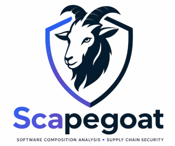

<center>

</center>

# Scapegoat

Scapegoat is an open-source Software Composition Analysis (SCA) platform designed to simplify Software Bill of Materials (SBOM) management and supply chain security. It provides a centralized dashboard for organizations to track dependencies, identify vulnerabilities, and enforce compliance policies across their software portfolio.

## Key Features

- **Comprehensive SBOM Support:** Import and analyze SBOMs in CycloneDX, SPDX, and Syft JSON formats.
- **Automated Vulnerability Scanning:** Integration with industry-standard scanners like Grype and OSV to identify known vulnerabilities (CVEs) in your dependencies.
- **Flexible Policy Engine:** Define and enforce custom security and compliance policies to ensure software meets your organization's standards.
- **GitHub Integration:** Seamlessly import repositories and manage SBOMs directly from your GitHub organizations.
- **License & Compliance Management:** Track software licenses across your projects and ensure legal compliance with built-in reporting.
- **Advanced Dependency Search:** Quickly locate specific packages and versions across your entire application hierarchy.
- **Interactive Dashboards:** Gain real-time insights into your security posture with intuitive visualizations and health metrics.

## Project Structure

This project is divided into two main parts:
- `backend/`: A Go-based API for scanning and analyzing SBOMs.
- `frontend/`: A React + TypeScript dashboard for visualizing the results.

## Tech Stack
- **Backend:** Go 1.25, Gin, GORM, PostgreSQL, Redis.
- **Frontend:** React 19, TypeScript, Vite, Tailwind CSS, TanStack Query, React Router.
- **Infrastructure:** Docker, Docker Compose.

## Getting Started

### Prerequisites
- Docker and Docker Compose (V2)

### Running the application
1. Clone the repository.
2. Initialize the environment:
   ```bash
   chmod +x scripts/init.sh
   ./scripts/init.sh
   ```
   *Note: This script creates the necessary files in the `shared/` directory. A `.env.example` is provided in the root for reference.*
3. Run the following command in the root directory:
   ```bash
   docker compose up --build
   ```
4. The frontend will be available at `http://localhost:5173`.
5. ZITADEL will be available at `http://localhost:8080`.
6. The backend API will be available at `http://localhost:8081`.

### Manual Testing
You can test the SBOM upload by uploading any valid CycloneDX, SPDX (JSON), or Syft JSON file through the UI.

### Unit Tests
To run backend tests:
```bash
cd backend
go test ./...
```
